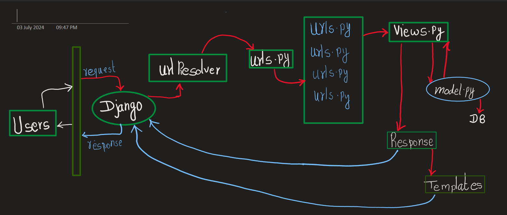
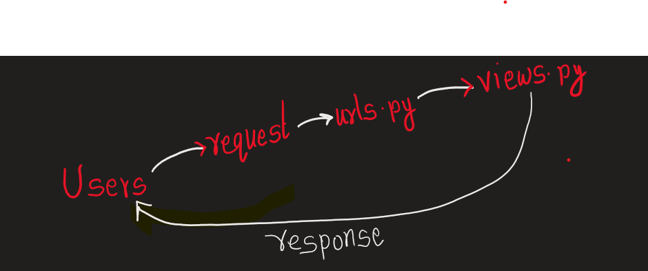

# 1. Create Virtual Environment

python -m venv .VirtualEnvaramentName

eg :-) python -m venv .venv

##### Activate virtual Environment
###### Windows
.venv/Scripts/activate
###### Mac/Linux
source .venv/Scripts/activate
###### deactivate :- to deactivate virtual environment

## 2. Install Django
pip install Django
### Create porject
django-admin startproject PROJECTNAME
### Run porject
python manage.py runserver

# DJANGO FLOW

single urls.py is project urls.py

_--> multiple one inside a table is app's urls.py

project urls.py hit app's urls.py 

since it is a framework,so name should be as same as in the diagram.

-->We have to create "views.py" mannualy

--> No "view.py" or nay other name

# Session 2
Create views.py in /DjamgoProj/DjamgoProj

# views.py
from django.http import HttpResponse
--> render mean to send html page, django.shorcuts is very powerful
from django.shortcuts import render

def home(request):
    # return HttpResponse("Hello,Dear !,It's Our home")
    -->after django.shortcuts render
    return render(request,'websites/index.html')
    --> websites/index.html is from templete path

def About(request):
    return HttpResponse("Hello,Dear !,You dont know about me")
def Contact(request):
    return HttpResponse("Hello,Dear !,Give me yor contact Number")

# urls.py
Import views.py
from . import views
 " . " mean from current directory

urlpatterns = [
    path('admin/', admin.site.urls),
    path('',views.home,name='home'),
    path('about/',views.About,name='about'),
    path('contact/',views.Contact,name='contact'),
]
## create folder "templates","static"

## templates directory
--> file index.html
--> css injecton:templete engine
<link rel="stylesheet" href="">

## settings.py
import os
TEMPLETES =[
    {
        'DIRS' : ['templates'],
    }
]
## By this django understand that every single apps have a templetes folder if not then there is tempaltes inside root directory

#STATIC_URL = 'static/'
STATICFILES_DIRS = [os.path.join(BASE_DIR,'static')]

## Static
--> style.cssf

# Jinja2 and web app
--> "startproject" only one time during initilization of project

--> https://docs.djangoproject.com/en/5.0/topics/templates/
--> https://jinja.palletsprojects.com/en/3.1.x/

(.DjangoEnv) PS S:\Learning\WEB DEV\DJANGO\ParadiseExplore\DjangoProj> python manage.py startapp pastha

# settings.py
--> make aware of app to project
 -->INSTALLED_APPS = [
    'django.contrib.admin',
    'django.contrib.auth',
    'django.contrib.contenttypes',
    'django.contrib.sessions',
    'django.contrib.messages',
    'django.contrib.staticfiles',
 ]

 --> these above apps are cooked in apps/file ,mean someone other have created it and we are using it

 --> add
 INSTALLED_APPS = [
    'pastha',
 ]
 --> now we have sucessfully configured a app

--> every app is a standalone app in itself,so many people prefer to have their templete inthe apps itself(most  prefareble)
/pastha/tempaltes/pastha/all_pastha.html
--> press( ctrl + ,) goto setting > search emmit>Emmet:Include Languages>Add Item "django-html" value = "html"
    --> after that we will get all django emmit html suggestation

-->also people prefer to make apps folder inside tempaltes.i.e--> templates/pastha/..

## Focus On Jinja

--> /pastha/tempaltes/pastha/all_pastha.html

### pastha/views.py
def all_pastha(request):
    return render(request,'pastha/all_pastha.html')

--> copy all the content of /DjangoProj/DjangoProj/urls.py
i.e
urlpatterns = [
    path('admin/', admin.site.urls),
    path('',views.home,name='home'),
    path('about/',views.About,name='about'),
    path('contact/',views.Contact,name='contact'),
    ..> added for app, control trasfer to pastha
    path('pastha/',include('pastha.urls')),

    path("__reload__/",include("django_browser_reload.urls")),
]

--> create pastha/urls.py
 add:

 urlpatterns = [
     path('',views.all_pastha,name='pastha'),
 ]
 --> remove admin header module inside pastha/urls.py since its not our responsibilty
 

-->create templates/layout.html

    -->layout.html is our template , we we need not to write our same html to every single page
in top of html page use 


### html attribute django
load

block

block unnamed

### templete/appname/index.html



Home Page



<h1> Django </h1>


